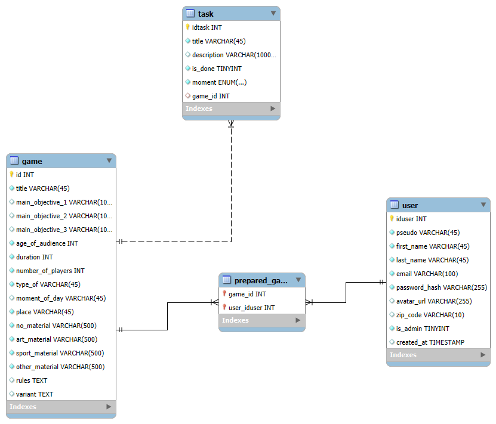

REPOSITORY CHECKPOINT 4 Wild Code School/Simplon

#Wireframe: "https://www.figma.com/design/gxQsrpfYrEFrIp4LnalwTI/CAP-?node-id=118-401&p=f&t=qmrpdwQfCzrPnyMn-0"

#DataBase: 

#Backlog:ORY CHECKPOINT 4 Wild Code School/Simplon

#Wireframe: "https://www.figma.com/design/gxQsrpfYrEFrIp4LnalwTI/CAP-?node-id=118-401&p=f&t=qmrpdwQfCzrPnyMn-0"

#DataBase: 

#Backlog: 

US1/home-page
As a user, I want to be able to access a home page where I can search for an activity in order to quickly respond to my professional needs.

US2/search
As a user, I want to be able to access a results page for my search so that I can quickly target and find an activity.

As a user, I want to be able to download an activity sheet so that I can have it physically available at my workplace.

US3/toDoList
As a user, I want to be able to create a to-do list linked to an activity in order to better organize myself at my workplace.

As a user, I want to be able to download my to-do list and my activity so that I have all the documents necessary to create an activity at once.

US4/auth
As a user I want to be able to create an account so that I can save a history of my activities and todolist

US5/advenced-research
As a user, I want to be able to search more precisely for games to meet very specific needs in my workplace.

# CAP! - Activities, Animations & Games Management Platform


## 🎯 Overview

**CAP!** is a comprehensive web application designed to help educators, animators, and activity coordinators discover, organize, and manage games and activities for various age groups and contexts. The platform provides an intuitive search system, detailed activity descriptions, task management, and PDF generation capabilities.

## ✨ Key Features

### 🔍 Smart Activity Search
- **Advanced Filtering**: Search activities by type, age group, duration, number of players, and material requirements
- **Category-based Organization**: Activities organized by type (games, sports, creative, educational)
- **Material Requirements**: Filter by material needs (no material, art supplies, sports equipment, other)

### 📋 Activity Management
- **Detailed Activity Profiles**: Complete information including objectives, rules, variants, and material requirements
- **PDF Export**: Generate downloadable activity sheets with complete instructions
- **Task Lists**: Create and manage preparation checklists for activities (before, during, after)

### 🎨 User Experience
- **Responsive Design**: Optimized for mobile, tablet, and desktop devices
- **Modern UI**: Clean, intuitive interface with custom branding and animations
- **Accessibility**: User-friendly navigation and clear visual hierarchy

### 👥 User Management
- **User Registration/Login**: Account creation and authentication system
- **Activity History**: Track consulted activities and created task lists
- **Personal Dashboard**: Manage personal activity preferences and history

## 🛠️ Technical Stack

### Frontend
- **React 19.1.0** with TypeScript
- **Vite** for build tooling and development server
- **React Router 7.4.1** for navigation
- **React Hook Form 7.61.1** with Yup validation
- **Custom CSS** with modern design patterns and animations

### Backend
- **Node.js** with Express.js
- **TypeScript** for type safety
- **MySQL** database with structured schema
- **PDF Generation** for activity sheets
- **RESTful API** architecture

### Development Tools
- **Biome** for linting and formatting
- **Jest** for testing
- **Docker** for containerization
- **Git Hooks** for code quality enforcement

## 🚀 Getting Started

### Prerequisites
- Node.js (version 18+)
- MySQL (version 8+)
- Git

### Installation

1. **Clone the repository**
   ```bash
   git clone https://github.com/IKAY-GH/cap.git
   cd cap
   ```

2. **Install dependencies**
   ```bash
   npm install
   ```

3. **Set up the database**
   ```bash
   # Run database migrations
   npm run db:migrate
   
   # Seed the database with sample data
   npm run db:seed
   ```

4. **Configure environment variables**
   ```bash
   # Copy environment template (create your own .env files)
   # Configure database connection and other settings
   ```

5. **Start the development servers**
   ```bash
   # Start both client and server in development mode
   npm run dev
   ```

The application will be available at:
- **Frontend**: http://localhost:3000
- **Backend API**: http://localhost:3310

## 📁 Project Structure

```
cap/
├── client/                 # React frontend application
│   ├── src/
│   │   ├── components/     # Reusable UI components
│   │   ├── pages/         # Application pages/routes
│   │   ├── assets/        # Images, icons, fonts, styles
│   │   └── types/         # TypeScript type definitions
│   └── public/            # Static assets
├── server/                # Express.js backend
│   ├── src/
│   │   ├── modules/       # Feature modules (games, tasks, users)
│   │   └── app.ts         # Express application setup
│   ├── database/          # Database schema and migrations
│   └── tests/             # Backend tests
├── bin/                   # Utility scripts
└── docs/                  # Documentation
```

## 🎮 Main Features Breakdown

### Activity Discovery
- Browse through a curated collection of activities
- Filter by multiple criteria simultaneously
- View detailed activity information including objectives and materials needed

### Activity Planning
- Generate comprehensive activity sheets
- Create customized task lists for activity preparation
- Download materials in PDF format for offline use

### Content Management
- Rich activity database with detailed metadata
- Support for multiple activity types and contexts
- Extensible system for adding new activities

### User Interface
- **Home Page**: Main search interface with visual filters
- **Results Page**: Grid layout showing filtered activities
- **Activity Details**: Complete activity information with action buttons
- **Task Management**: Interactive checklists for activity preparation
- **User Authentication**: Secure login and registration system

## 🎨 Design System

### Color Palette
- **Primary Yellow**: #FFB733 (Navigation/Footer)
- **Primary Orange**: #F57336 (Buttons/Actions)
- **Text Color**: #3B3B3B (Main content)
- **Background**: Custom pirate-themed imagery with transparency

### Typography
- **Primary Font**: Helvetica for body text
- **Display Font**: "Pieces of Eight" for titles and branding
- **Responsive sizing** across all device breakpoints

## 🔧 API Endpoints

### Games/Activities
- `GET /api/game` - Fetch all activities
- `GET /api/game/:id` - Get specific activity details
- `GET /api/game/search` - Search with filters
- `POST /api/game` - Create new activity

### Tasks
- `GET /api/task/game/:gameId` - Get tasks for specific activity
- `POST /api/task` - Create new task
- `PUT /api/task/:id` - Update task
- `DELETE /api/task/:id` - Delete task

### PDF Generation
- `GET /api/pdf/game-sheet/:gameId` - Download activity sheet
- `POST /api/pdf/todolist` - Generate task list PDF

### User Management
- `POST /api/users/inscription` - User registration
- `GET /api/user/:id` - Get user profile
- `POST /api/user-history/consultation` - Track activity views

## 🧪 Testing

```bash
# Run all tests
npm run test

# Run backend tests only
npm run test --workspace=server

# Run frontend tests only  
npm run test --workspace=client
```

## 🚀 Deployment

### Production Build
```bash
# Build both client and server
npm run build

# Start production server
npm run start
```

### Docker Deployment
```bash
# Build and run with Docker Compose
docker-compose up -d

# For production environment
docker-compose -f docker-compose.prod.yml up -d
```

## 📝 Contributing

1. Fork the repository
2. Create a feature branch (`git checkout -b feature/amazing-feature`)
3. Commit your changes (`git commit -m 'Add some amazing feature'`)
4. Push to the branch (`git push origin feature/amazing-feature`)
5. Open a Pull Request

### Code Quality
- Follow TypeScript best practices
- Use Biome for linting and formatting
- Write tests for new features
- Maintain responsive design principles

## 📄 License

This project is licensed under the MIT License - see the [LICENSE.md](LICENSE.md) file for details.

## 👤 Author

**IKAY-Projects**
- GitHub: [@IKAY-GH](https://github.com/IKAY-GH)
- Project Link: [https://github.com/IKAY-GH/cap](https://github.com/IKAY-GH/cap)

## 🙏 Acknowledgments

- Designed for educators and activity coordinators
- Built with modern web technologies
- Focused on user experience and accessibility
- Community-driven activity database
